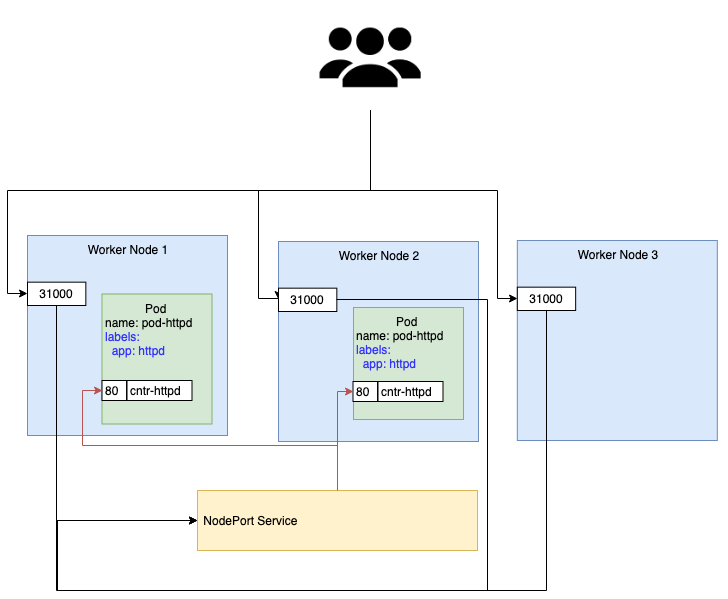

# Services - Nodeport

In Kubernetes, 'services' is actually all about networking. In Docker world, when you use docker-compose, all the networking is done for you automatically behind the scenes. However that's not the case when it comes to kubernetes. To setup networking in Kubernetes, you need to create 'service' objects.

A single pod exists inside a single node. So if the node dies, then the pod dies with it. However that's not the case case with services. A service exists cluster-wide. 



There are [4 main types of services](https://kubernetes.io/docs/concepts/services-networking/service/#publishing-services-service-types).

In this example let's just spin up the following pods for now:

```bash
$ kubectl apply -f configs/pod-centos.yml
pod/pod-centos created
$ kubectl apply -f configs/pod-httpd.yml
pod/pod-httpd created


$ kubectl get pods -o wide
NAME         READY   STATUS    RESTARTS   AGE   IP           NODE       NOMINATED NODE   READINESS GATES
pod-centos   1/1     Running   0          8s    172.17.0.7   minikube   <none>           <none>
pod-httpd    1/1     Running   0          4s    172.17.0.8   minikube   <none>           <none>

```

At this stage we have created 2 pods, pod-httpd is an apache webserver listening on port 80, and pod-centos is a generic centos container. Kubernetes automatically assigns an IP address to each pod. These ip address makes it possible for all the pods in a kubecluster to reach each other:

```bash
$ kubectl exec pod-centos -it -c cntr-centos -- /bin/bash
[root@pod-centos /]# curl http://172.17.0.8
<html><body><h1>It works!</h1></body></html>
```

These IPs are in an private internal ip range that's only accessible from within the kubecluster. So if try to run this curl this ip from your macbook then it will fail. However just for testing purposes, you can temporarily set up port forwarding, on your macbook, run:

```bash
$ kubectl port-forward pod-httpd 8080:80
Forwarding from 127.0.0.1:8080 -> 80
Forwarding from [::1]:8080 -> 80
```

This will cause your terminal to hang, so you have to open up another bash terminal on your macbook to test this:

```bash
$ curl http://127.0.0.1:8080
<html><body><h1>It works!</h1></body></html>
```

Here your request get's forwarded to port 80 on the pod-httpd pod.

## Nodeport Service Type

We've just seen that we can do pod-2-pod communication via the auto-assigned ip addresses. However using IPs like this is unreliable because pods are not gauranteed to always have the same ip addresses. That's why it's best practice for pods to talk to each other using dns addresses, and that's possible by creating service objects. Let's create a nodeport service object:

```yaml
---
apiVersion: v1
kind: Service
metadata:
  name: svc-nodeport-httpd
spec:
  type: NodePort
  ports:
    - port: 3050      # This is the port to use by other pods to reach target port
      targetPort: 80     # This is the port the destination pod is listening on. 
      nodePort: 31000     # port to use from your macbook
  selector:
    component: httpd   # this service will forward traffic to any pods with this label. 
```

With this in place, you can now do pod-2-pod communication using a dns name. The full dns name is the metadata.name value from above, along with what's specified in the /etc/resolv.conf file:

```bash
$ kubectl exec pod-centos -it -c cntr-centos -- /bin/bash


[root@pod-centos /]# cat /etc/resolv.conf
nameserver 10.96.0.10
search default.svc.cluster.local svc.cluster.local cluster.local
options ndots:5


[root@pod-centos /]# curl http://svc-nodeport-httpd.default.svc.cluster.local:3050
<html><body><h1>It works!</h1></body></html>
```

The 'default' actually refers to the namespace. If our pod-httpd pod was in different namespace, then our dns name needs to specify that namespace instead. In this example both pods are in the 'default' namespace, which means we can in fact get our curl command to work with the dns shortname:

```bash
[root@pod-centos /]# curl http://svc-nodeport-httpd:3050
<html><body><h1>It works!</h1></body></html>
```


So to access the pods externally, e.g. from your macbook, then you use your minikube's ip address.

```bash
$ minikube ip
192.168.99.105

$ curl http://192.168.99.105:31000
<html><body><h1>It works!</h1></body></html>
```

Another way to find out the above url is:

```bash
$ minikube service svc-nodeport-httpd --url
http://192.168.99.105:31000
```

Using the ip address here isn't as bad, since it's the minikube VM's ip rather than a pod ip. If you omit the --url flag, then minikube will open this link in a your macbook's web browser for you.

```bash
$ minikube service svc-nodeport-apache-webserver
🎉  Opening kubernetes service default/svc-nodeport-apache-webserver in default browser...
```

As you can see, the nodePort service object not only makes it easier for pod-2-pod communications, by setting up static dns names. But also makes pods externally accessible (without setting up port-forwarding).

## Nodeport Services are kubecluster wide

When you create a nodeport service, than all worker nodes in the kubecluster is listening on the Nodeport's port, even workers that doesn't have the pod in question. So when you access the port on a worker node, that request gets routed to the nodeport service first, then the node port service forwards your request onto the worker node, that has the pod in question.

## Drawbacks to using nodeport

Nodeport is actually rarely used in production, and is mainly used for development purposes only. That's because:

- url endpoint needs to explicitly end with ':{port number}'. That looks ugly, doesn't scale well, and keep tracking of lots of pod numbers would be a nightmare. One way around this is by putting a load balacner (e.g. aws ELB) in front of the worker nodes, that does portforwarding internally. In which case you would need one loadbalancer for each non-standard port number, which can get pricey. 
- You'll end up using a lot of non-standard ports. 
- all the port numbers requires extra work on the cloud platfrom.
- To set up HA, you need to create an ELB for each nodeport service.


That's why there are other types of service objects such as Ingress and ClusterIP service objects which we'll cover later.

